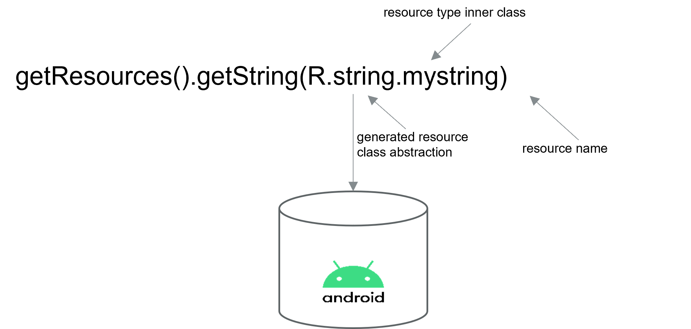
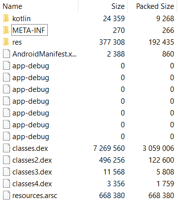
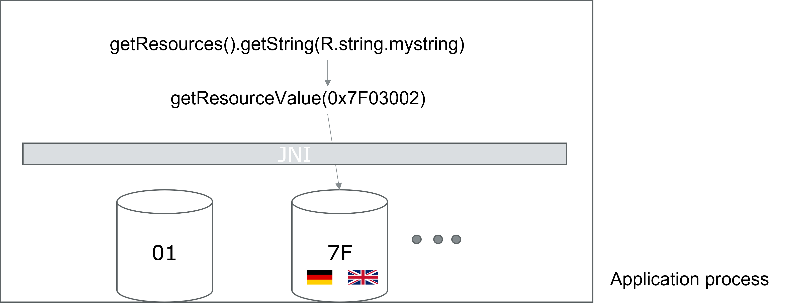
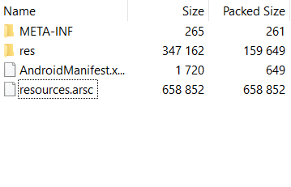
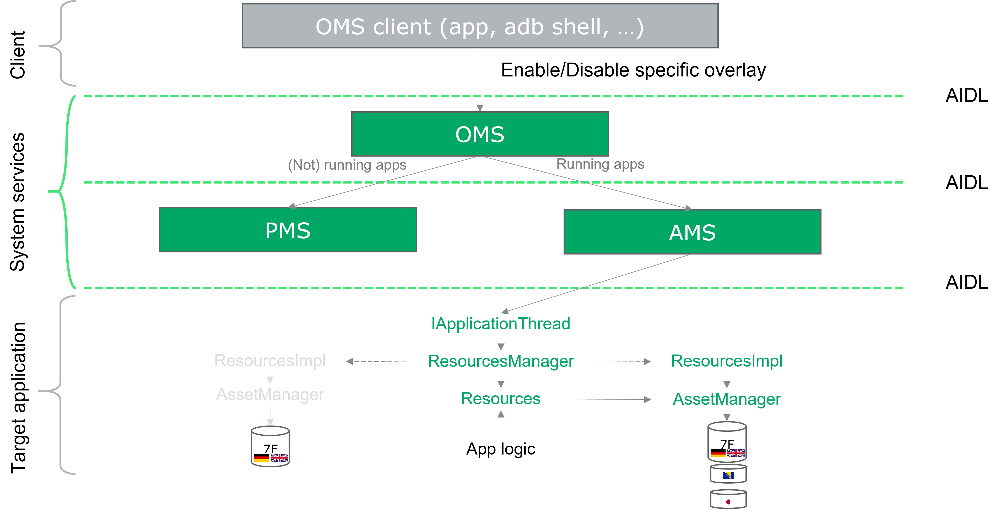
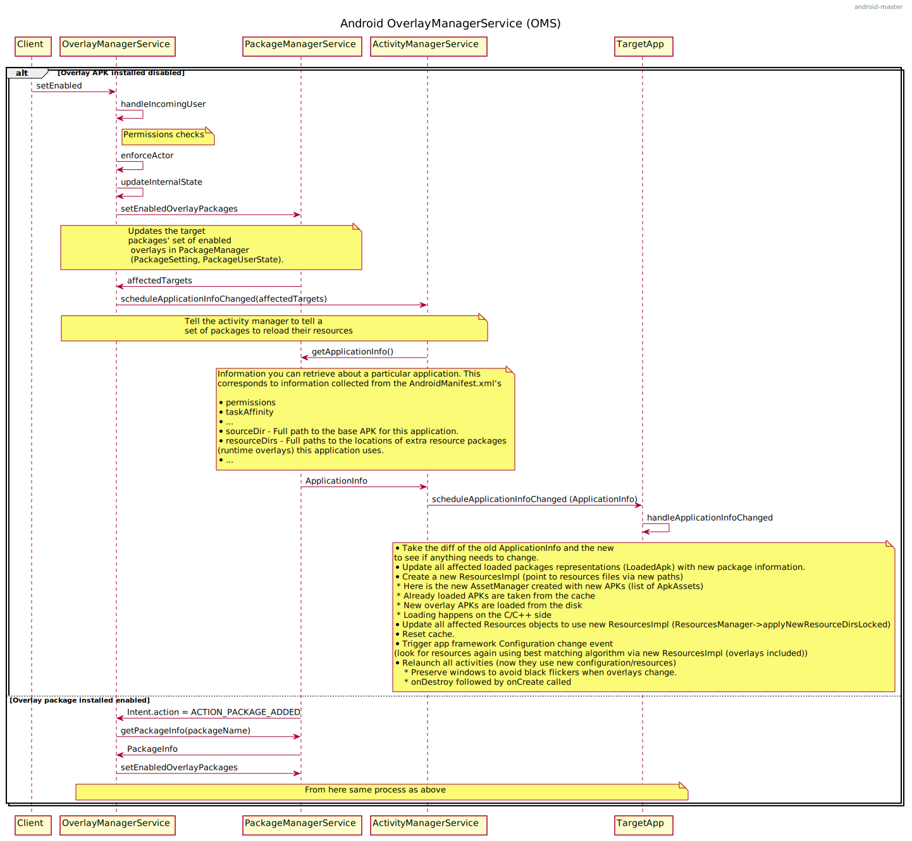
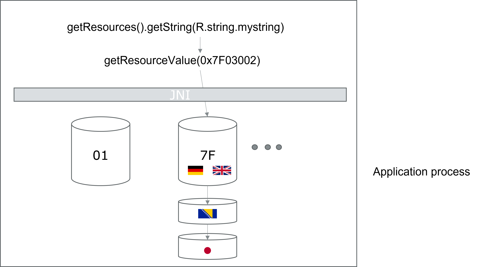
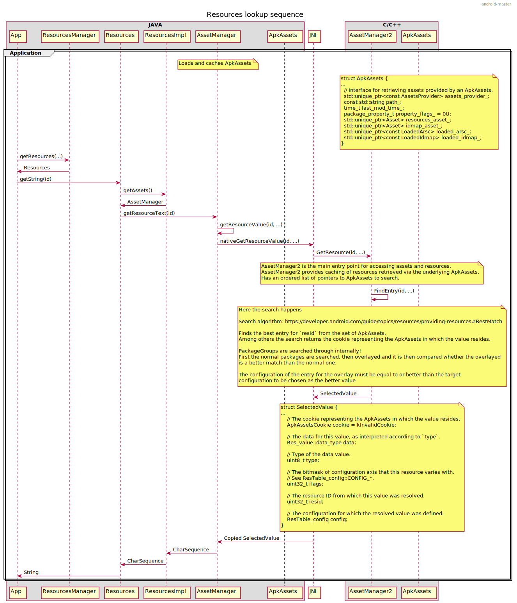
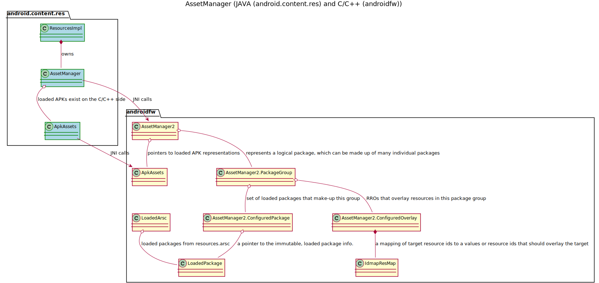

# android-rro

This repository is a collection of diagrams and other resources that explain the internals of the 
Android´s Runtime Resource Overlay (RRO) mechanism.

## Android resources

### What are resources in the Android context?

* Resources are the additional files and static content that an app code uses, such as bitmaps, layout definitions, 
  strings, etc.
* Resources concept allows for an abstracted referencing of the used resources in an app
    * Resources can be accessed through the generated IDs in the projects R class
      * R class contains mappings between the resource names and their generated unique numerical qualifiers
* Resources are maintained independently of the app logic
  * *res* folder and XML
* Alternative resources can be provided for different device configurations (resource qualifiers)
* Resources can be changed/updated during the runtime by the system (runtime resource overlays)




### Where can one locate resources?

* Android apps are distributed in the format called Android application package (APK)
* Application resources are part of the same APK as the app bytecode itself:
  * Resources as created during the app development (res folder)
  * Resources precompiled in a specific binary format optimized for searching and loading activities (resources.arsc)
    
    * [Android Asset Packaging Tool (aapt)](https://maven.google.com/web/index.html?q=aapt#com.android.tools.build:aapt2:7.1.0-alpha12-7639132 ) is used for this task
    * All resources are indexed using highly optimized hash map for fast runtime lookups
    * All resources are indexed via unique resource numerical identifiers
    * *resources.arsc* uses a binary uncompressed format
    * *resources.arsc* content is encoded using device native endianness 

Example content of the APK package:



### Resource numerical qualifiers

* Every resource of the given type is enumerated with a unique numerical qualifier within the resources.arsc
* These qualifiers are generated when compiling an Android app
  * Unique per compilation
  * Generated *R* class provides mapping between the resource names and their unique numerical qualifiers
* Resource numerical qualifiers are composed from 3 parts. First byte encodes the package type, second byte resource
type and the last 2 bytes the table entry for the given type. For instance, *0x7F0300002* is interpreted as
*third resource of type 03 in a regular application.* Type and entry parts are newly generated with each app build.
The generator simply enumerates the types as they appear in the XML that describes the resources. The entry part is 
incremented as each new resource of the same type is encountered. However, package type is static, *7F* is used to 
denote application APKs, *01* for Android framework and *00* for shared resource libraries.

* Resource numerical qualifiers can map to multiple resources
  * The same resource numerical qualifier can map to different values based on parameters outside of the running application (specific device configuration)
    * Resources maintainers have to denote the specific resources with [specific qualifiers](https://developer.android.com/guide/topics/resources/providing-resources#AlternativeResources)
    * E.g. *drawable-en* and *drawable-de* same resource available for different languages
      
* At a particular point in time only a [best matching](https://developer.android.com/guide/topics/resources/providing-resources#BestMatch)
resource will be selected by the system



An application process may load multiple APKs and device might contain multiple configurations.
Using resource numerical qualifiers and configuration qualifiers, the best matching algorithm selects the best matching
resource at certain point in time and returns it to the application.

### Resource representation in *resources.arsc*

*resources.arsc* format is modeled in this [file](https://cs.android.com/android/platform/superproject/+/master:frameworks/base/libs/androidfw/include/androidfw/ResourceTypes.h
) within the AOSP.

The following is an extraction of the resource representation model within *resources.arsc*:

```cpp
/**
 * Representation of a value in a resource, supplying type
 * information.
 */
struct Res_value
{
    // Number of bytes in this structure.
    uint16_t size;

    // Always set to 0.
    uint8_t res0;
        
    // Type of the data value.
    enum : uint8_t {
        // The 'data' is either 0 or 1, specifying this resource is either
        // undefined or empty, respectively.
        TYPE_NULL = 0x00,
        // The 'data' holds a ResTable_ref, a reference to another resource
        // table entry.
        TYPE_REFERENCE = 0x01,
        // The 'data' holds an attribute resource identifier.
        TYPE_ATTRIBUTE = 0x02,
        // The 'data' holds an index into the containing resource table's
        // global value string pool.
        TYPE_STRING = 0x03,
        // The 'data' holds a single-precision floating point number.
        TYPE_FLOAT = 0x04,
        // The 'data' holds a complex number encoding a dimension value,
        // such as "100in".
        TYPE_DIMENSION = 0x05,
        // The 'data' holds a complex number encoding a fraction of a
        // container.
        TYPE_FRACTION = 0x06,
        // The 'data' holds a dynamic ResTable_ref, which needs to be
        // resolved before it can be used like a TYPE_REFERENCE.
        TYPE_DYNAMIC_REFERENCE = 0x07,
        // The 'data' holds an attribute resource identifier, which needs to be resolved
        // before it can be used like a TYPE_ATTRIBUTE.
        TYPE_DYNAMIC_ATTRIBUTE = 0x08,

        // Beginning of integer flavors...
        TYPE_FIRST_INT = 0x10,

        // The 'data' is a raw integer value of the form n..n.
        TYPE_INT_DEC = 0x10,
        // The 'data' is a raw integer value of the form 0xn..n.
        TYPE_INT_HEX = 0x11,
        // The 'data' is either 0 or 1, for input "false" or "true" respectively.
        TYPE_INT_BOOLEAN = 0x12,

        // Beginning of color integer flavors...
        TYPE_FIRST_COLOR_INT = 0x1c,

        // The 'data' is a raw integer value of the form #aarrggbb.
        TYPE_INT_COLOR_ARGB8 = 0x1c,
        // The 'data' is a raw integer value of the form #rrggbb.
        TYPE_INT_COLOR_RGB8 = 0x1d,
        // The 'data' is a raw integer value of the form #argb.
        TYPE_INT_COLOR_ARGB4 = 0x1e,
        // The 'data' is a raw integer value of the form #rgb.
        TYPE_INT_COLOR_RGB4 = 0x1f,

        // ...end of integer flavors.
        TYPE_LAST_COLOR_INT = 0x1f,

        // ...end of integer flavors.
        TYPE_LAST_INT = 0x1f
    };
    uint8_t dataType;

    // Structure of complex data values (TYPE_UNIT and TYPE_FRACTION)
    enum {
        // Where the unit type information is.  This gives us 16 possible
        // types, as defined below.
        COMPLEX_UNIT_SHIFT = 0,
        COMPLEX_UNIT_MASK = 0xf,

        // TYPE_DIMENSION: Value is raw pixels.
        COMPLEX_UNIT_PX = 0,
        // TYPE_DIMENSION: Value is Device Independent Pixels.
        COMPLEX_UNIT_DIP = 1,
        // TYPE_DIMENSION: Value is a Scaled device independent Pixels.
        COMPLEX_UNIT_SP = 2,
        // TYPE_DIMENSION: Value is in points.
        COMPLEX_UNIT_PT = 3,
        // TYPE_DIMENSION: Value is in inches.
        COMPLEX_UNIT_IN = 4,
        // TYPE_DIMENSION: Value is in millimeters.
        COMPLEX_UNIT_MM = 5,

        // TYPE_FRACTION: A basic fraction of the overall size.
        COMPLEX_UNIT_FRACTION = 0,
        // TYPE_FRACTION: A fraction of the parent size.
        COMPLEX_UNIT_FRACTION_PARENT = 1,

        // Where the radix information is, telling where the decimal place
        // appears in the mantissa.  This give us 4 possible fixed point
        // representations as defined below.
        COMPLEX_RADIX_SHIFT = 4,
        COMPLEX_RADIX_MASK = 0x3,

        // The mantissa is an integral number -- i.e., 0xnnnnnn.0
        COMPLEX_RADIX_23p0 = 0,
        // The mantissa magnitude is 16 bits -- i.e, 0xnnnn.nn
        COMPLEX_RADIX_16p7 = 1,
        // The mantissa magnitude is 8 bits -- i.e, 0xnn.nnnn
        COMPLEX_RADIX_8p15 = 2,
        // The mantissa magnitude is 0 bits -- i.e, 0x0.nnnnnn
        COMPLEX_RADIX_0p23 = 3,

        // Where the actual value is.  This gives us 23 bits of
        // precision.  The top bit is the sign.
        COMPLEX_MANTISSA_SHIFT = 8,
        COMPLEX_MANTISSA_MASK = 0xffffff
    };

    // Possible data values for TYPE_NULL.
    enum {
        // The value is not defined.
        DATA_NULL_UNDEFINED = 0,
        // The value is explicitly defined as empty.
        DATA_NULL_EMPTY = 1
    };

    // The data for this item, as interpreted according to dataType.
    typedef uint32_t data_type;
    data_type data;

    void copyFrom_dtoh(const Res_value& src);
};
```

* For primitive data types, *data* is the concrete value
* For strings, *data* is the offset to the part of the *resources.arsc* where the string pool is stored (+1 lookup)
* For files (bitmaps, xmls, ...), *data* is the offset to the part of *resources.arsc* where the strings are stored.
The stored string is the path then to the actual file in the application APK (+2 lookups).

## Runtime Resource Overlays (RROs)

* RRO is a way to overlay the resources of an app or framework during runtime
* Use cases:
  * Customization
    * 1 build, multiple configurations
  * Personalised themes
    * Color, bitmaps, ...
    
* RRO is designed with the following requirements in mind:
  * The apps that do not want to use RRO should not deal with it
  * Load and lookup should not be any slower than load and lookup of regular resources
  * No reboots while reloading
  * It should be compatible with the existing Android security model
  * Memory footprint should be low – no big databases, no new XMLs, …

### Format

* It is a regular APK with a few caveats
  * No bytecode
  * Overlayed resources must have the same name as the ones in the application APK
  * Manifest file must contain overlay tag that names the target application or the framework that shall be modified



### RROs on the system level

* *OverlayManagerService* (OMS) is an Android system service that controls/triggers RRO deployment
* OMS holds *OverlayInfo* structure for each overlay package in the system
* *OverlayInfo* contains metadata required by the OMS to successfully deploy the overlay

  * State
  * Package name
  * Target package name
  * Etc.
* OMS cooperates with *PackageManagerService* (PMS) and *ActivityManagerService* (AMS) in order to deploy the requested overlay 
during the runtime
* For apps that are currently not running, OMS interacts with PMS, which then sets up the overlay 
APK paths for the app that should use the overlay. Later, when the app is started in will be loaded with the correct overlay
* For apps that are running, OMS interacts with AMS. 
AMS goes through its list of running processes. 
For any app or framework affected with the overlay change, the AMS sends a message to it. 
The application thread picks up the message and triggers the *ResourceManager*, which then swaps the resource implementation 
with the new one that contains the enabled overlay. 
This swap causes an application to perform *onConfigurationChanged*. 
This ensures that the correct overlayed resources are in use after *Activity* recreation.

High level representation of system components involved in RROs:



More detailed sequence diagram with interactions between the system components:



### Lookup



* Android Application framework loads overlay APKs to the right place
* Resources are compared using qualifiers and the previously mentioned best matching algorithm
* For resources with the same qualifiers, the system prefers the overlayed resource always
  * For instance, a default resource for the overlay package would win over the default resource from the target app
    package
* Resource numerical qualifiers differ in the overlay packages and the target package
  * [Idmap](https://cs.android.com/android/platform/superproject/+/master:frameworks/base/cmds/idmap2/) tool is used to
    provide the mappings between the two so that the lookup algorithm can work as expected
    * It uses the *resources.arsc* to perform the reverse mapping, name and type to target unique numerical qualifier

The following diagram illustrates the lookup sequence procedure including multiple AOSP components from the Android
app framework:



### AssetManager

[*AssetManager2*](https://cs.android.com/android/platform/superproject/+/master:frameworks/base/libs/androidfw/include/androidfw/AssetManager2.h) 
is the main entry point for accessing assets and resources.
*AssetManager2* provides caching of resources retrieved via the underlying ApkAssets.
AssetManager2 provides a logical abstraction called *PackageGroup* that unifies the target app packages and overlay 
packages that are enabled during runtime. The previously shown lookup procedure uses *PackageGroup*s when searching for
a particular resource via its resource numerical qualifier. First, the target packages are searched, then the overlayed
packages. The best match is then returned to the querying app.




## References

* [Resource Overlays - Marten Kongstad and Zoran Jovanovic](https://youtu.be/S9o0S0RRNXs)
* [Android app resources overview](https://developer.android.com/guide/topics/resources/providing-resources)
* [idmap2](https://cs.android.com/android/platform/superproject/+/master:frameworks/base/cmds/idmap2/)
* [androidfw/ResourceTypes.h](https://cs.android.com/android/platform/superproject/+/master:frameworks/base/libs/androidfw/include/androidfw/ResourceTypes.h)
* [OMS](https://cs.android.com/android/platform/superproject/+/master:frameworks/base/services/core/java/com/android/server/om/)
* [OMS AIDL](https://cs.android.com/android/platform/superproject/+/master:frameworks/base/core/java/android/content/om/)
* [PMS](https://cs.android.com/android/platform/superproject/+/master:frameworks/base/core/java/android/content/pm/)
* [AOSP resources](https://cs.android.com/android/platform/superproject/+/master:frameworks/base/core/java/android/content/res)
* [AOSP App framework](https://cs.android.com/android/platform/superproject/+/master:frameworks/base/core/java/android/app)
* [AOSP JNI glue code](https://cs.android.com/android/platform/superproject/+/master:frameworks/base/core/jni/)
* [AOSP native code](https://cs.android.com/android/platform/superproject/+/master:frameworks/base/libs/androidfw/include/androidfw/)
